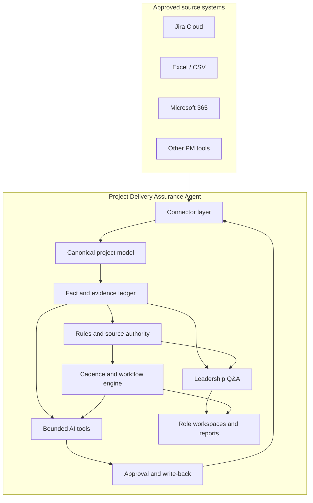

# Project Delivery Assurance Agent

[](#current-status)
[](docs/00-governance/DOCUMENT_CONTROL.md)
[](docs/06-commercial-deployment/CUSTOMER_HOSTING_MODEL.md)
[](LICENSE.md)

> A customer-hosted, evidence-grounded delivery assurance layer that monitors project execution, requests missing updates, follows up on commitments, recommends interventions, controls write-back, and answers leadership questions from traceable sources of truth.

**Working product name:** Project Delivery Agent  
**Product category:** Agentic Digital PMO / Project Delivery Assurance  
**Repository baseline:** v0.1 Approved candidate (effective after Issue #1 review PR merge)
**Baseline date:** 5 September 2026

## Why this product exists

Project information is commonly spread across Jira, spreadsheets, PowerPoint, email, Teams, SharePoint, and other work-management tools. Although the underlying data exists, PMs and PMOs still spend substantial time:

- chasing project owners for updates;
- reconciling conflicting status information;
- identifying stale risks, dependencies, and forecasts;
- preparing leadership reports and steering packs;
- explaining why a project is delayed;
- updating multiple systems after receiving a response; and
- proving which source supported a management statement.

The Project Delivery Assurance Agent is intended to sit **above** the tools that teams already use. It does not replace Jira, PMs, Scrum Masters, or enterprise portfolio systems. It provides a governed coordination, accountability, evidence, and decision-support layer across them.

## Core operating loop

```text
Observe → Verify → Ask → Follow up → Recommend → Approve → Act → Explain → Publish
```



```mermaid
flowchart LR
    A[Observe approved sources] --> B[Verify freshness and authority]
    B --> C{Information complete?}
    C -- No --> D[Ask responsible person]
    D --> E[Follow up and escalate by policy]
    E --> F[Interpret and structure response]
    C -- Yes --> G[Evaluate delivery signals]
    F --> G
    G --> H[Recommend next action]
    H --> I{Material external change?}
    I -- Yes --> J[Human approval]
    I -- No --> K[Execute permitted action]
    J --> K
    K --> L[Create evidence and action receipt]
    L --> M[Explain status to authorised users]
    M --> N[Publish dashboard, email, PPTX or PDF]
```

## Product capabilities

| Capability | What the product should do |
|---|---|
| Project truth | Normalise facts from Jira, spreadsheets, collaboration tools, and documents while retaining source provenance. |
| Freshness monitoring | Detect stale, incomplete, missing, or contradictory project information. |
| Interactive update collection | Ask focused questions instead of sending generic “please update” reminders. |
| Cadence and escalation | Follow configurable schedules, reminders, absence rules, and escalation paths. |
| Role-based advice | Recommend practical actions to PMs, Scrum Masters, team leads, PMOs, and leadership. |
| Controlled write-back | Translate human responses into proposed structured updates, obtain the required approval, and update permitted source-system fields. |
| Leadership Q&A | Answer questions such as “Why is this project delayed?” using current evidence and clearly labelled uncertainty. |
| Reporting | Produce an authenticated live view, concise email digest, and timestamped PowerPoint/PDF snapshot from the same verified facts. |
| Audit and governance | Record fact history, approvals, agent runs, external actions, and immutable action receipts. |
| Customer control | Support single-tenant customer-hosted deployment and customer-selected AI providers or private model endpoints. |

## Evidence-first principles

The product must distinguish among:

```text
SYSTEM_VERIFIED
HUMAN_CONFIRMED
AGENT_INFERENCE
CONFLICTING
STALE
UNKNOWN
```

The language model may interpret, extract, summarise, explain, and recommend. Deterministic application code must remain responsible for permissions, date calculations, health indicators, source authority, approval requirements, reminder timing, and whether an external action is permitted.

Material changes such as milestone dates, baselines, ownership, RAG status, budget, or customer-facing commitments require human approval in the initial product releases.

## Release 1 objective

Release 1 proves one complete, production-shaped closed loop:

1. Read delivery information from Jira Cloud and a portfolio spreadsheet.
2. Normalise the information into a canonical project model.
3. Detect a stale update, missing context, or evidence contradiction.
4. Contact the responsible person with a contextual question.
5. Capture and interpret a free-text response.
6. Present the proposed structured change with current value, new value, source, reason, and affected system.
7. Obtain the required PM approval for a material change.
8. Write an approved comment to Jira; structured field updates are deferred to R2.
9. Create an immutable action receipt and evidence trail.
10. Recommend the next delivery intervention.
11. Answer a leadership question with linked evidence and uncertainty labels.
12. Refresh the live dashboard and generate a management snapshot.
13. Support shadow mode, where all outbound actions remain proposals until explicitly enabled.

See [Release 1 Vertical Slice](docs/04-delivery/RELEASE-1-VERTICAL-SLICE.md) and [Event Demo Scenario](docs/04-delivery/EVENT_DEMO_SCENARIO.md).

## Current status

This repository contains an approved implementation contract and a runnable **synthetic development foundation**: web/API/worker, database, identity validation, scoped access, encrypted credential primitives and audit protection. Baseline, master-plan and partial-foundation PRs #2, #3 and #4 are merged with passing checks. Full story acceptance and production readiness remain open.

| Area | Status |
|---|---|
| Business and product definition | Approved R0/R1 contract |
| Functional, technical, and non-functional requirements | Approved R0/R1 contract |
| Solution, data, integration, AI, workflow, security, and deployment architecture | Approved R0/R1 contract |
| Release 1 epics, stories, acceptance criteria, and dependency map | Master plan merged; four milestones and ten implementation issues published |
| Test strategy, golden scenarios, threat model, and Definition of Done | Drafted |
| Commercial, customer-hosting, support, and source-access models | Drafted |
| Machine-readable requirements and traceability | Available |
| Documentation validation | 245 requirements, 91 criteria, no Must coverage gap |
| Independent baseline review | Exact candidate approved; PR #2 merged with passing checks |
| Application implementation | Partial foundation merged in PR #4; all five R0 stories remain in progress |

See [local setup](docs/06-commercial-deployment/LOCAL_DEVELOPMENT.md), [implementation status](docs/04-delivery/IMPLEMENTATION_STATUS.md), and [foundation evidence](docs/05-quality/FOUNDATION_VALIDATION.md). Customer deployment and real-data integrations remain gated by the approved baseline and required review evidence.

## Planned technical architecture

The current architecture decision baseline is:

| Layer | Planned technology |
|---|---|
| Frontend | React, Vite, TypeScript, Tailwind CSS, shadcn/ui |
| Backend | NestJS modular monolith, REST/OpenAPI, SSE |
| Data | PostgreSQL, pgvector, Prisma behind repository interfaces |
| Background execution | Graphile Worker and database-backed workflow state |
| AI | Provider-neutral adapter using Vercel AI SDK and schema-validated outputs |
| Jira | `jira.js` behind a narrow, permission-aware connector |
| Microsoft ecosystem | Microsoft Graph JavaScript SDK in the enterprise collaboration release |
| Reporting | PptxGenJS, ExcelJS, and HTML-to-PDF |
| Identity | OIDC with customer identity providers; application RBAC and project-level access |
| Deployment | OCI containers, Docker Compose or Podman-compatible customer-hosted package |
| Testing | Unit, integration, contract, Playwright E2E, agent evaluations, and failure recovery tests |



Detailed decisions are recorded under [Architecture](docs/03-architecture/) and [Architecture Decision Records](docs/03-architecture/adr/).

## Documentation map

Start with [Documentation Home](docs/README.md) or use the paths below.

| Area | Primary documents |
|---|---|
| Governance | [Document Index](docs/00-governance/DOCUMENT_INDEX.md), [Document Control](docs/00-governance/DOCUMENT_CONTROL.md), [Open Decisions](docs/00-governance/OPEN_DECISIONS.md) |
| Business and product | [Vision](docs/01-business-product/VISION_AND_STRATEGY.md), [BRD](docs/01-business-product/BRD.md), [PRD](docs/01-business-product/PRD.md), [Scope](docs/01-business-product/PRODUCT_SCOPE.md) |
| Requirements | [FRD](docs/02-requirements/FRD.md), [NFR](docs/02-requirements/NFR.md), [TRD](docs/02-requirements/TRD.md), [Agent Behavior](docs/02-requirements/AGENT_BEHAVIOR.md) |
| Architecture | [Solution Architecture](docs/03-architecture/SOLUTION_ARCHITECTURE.md), [Data Model](docs/03-architecture/DATA_MODEL.md), [AI and Grounding](docs/03-architecture/AI_AND_GROUNDING_ARCHITECTURE.md) |
| Delivery | [Roadmap](docs/04-delivery/PRODUCT_ROADMAP.md), [Release 1](docs/04-delivery/RELEASE-1-VERTICAL-SLICE.md), [Epics and Stories](docs/04-delivery/EPICS_AND_STORIES.md) |
| Quality | [Test Strategy](docs/05-quality/TEST_STRATEGY.md), [Golden Scenarios](docs/05-quality/GOLDEN_TEST_SCENARIOS.md), [Threat Model](docs/05-quality/THREAT_MODEL.md) |
| Commercial and deployment | [Commercial Model](docs/06-commercial-deployment/COMMERCIAL_MODEL.md), [Customer Hosting](docs/06-commercial-deployment/CUSTOMER_HOSTING_MODEL.md), [Support and Upgrades](docs/06-commercial-deployment/SUPPORT_AND_UPGRADES.md) |
| Research | [Market Review](docs/07-research/MARKET_AND_COMPETITOR_REVIEW.md), [GitHub Review](docs/07-research/GITHUB_REPOSITORY_REVIEW.md), [Open-Source Register](docs/07-research/OPEN_SOURCE_ADOPTION_REGISTER.md) |

## Repository structure

```text
.
├── .github/                         Issue forms, PR template, validation workflow
├── docs/
│   ├── 00-governance/              Document control, assumptions, decisions, traceability
│   ├── 01-business-product/        Vision, BRD, PRD, scope, personas, use cases, metrics
│   ├── 02-requirements/             FRD, NFR, TRD, RBAC, agent and workflow requirements
│   ├── 03-architecture/             Solution, domain, data, integration, AI, security, ADRs
│   ├── 04-delivery/                 Roadmap, Release 1, epics, stories, acceptance criteria
│   ├── 05-quality/                  Test strategy, evaluations, threats, failure scenarios
│   ├── 06-commercial-deployment/    Hosting, licensing, pilot, support, commercial model
│   └── 07-research/                 Market, GitHub, open-source, and alternative analysis
├── requirements/                   Machine-readable requirements and traceability
├── scripts/                        Documentation validation utilities
├── AGENTS.md                       Binding instructions for Codex and contributors
├── PLANS.md                        ExecPlan standard for complex implementation tasks
├── OPEN_SOURCE_POLICY.md           Dependency and clean-room rules
├── SECURITY.md                     Security reporting and repository handling guidance
├── CONTRIBUTING.md                 Contribution and review workflow
└── LICENSE.md                      Proprietary software notice
```

## Working with Codex

Before implementing any issue, Codex and human contributors must:

1. Read [AGENTS.md](AGENTS.md).
2. Read the requirement IDs and acceptance criteria referenced by the issue.
3. Read applicable ADRs and architecture documents.
4. Create an ExecPlan when the change crosses the thresholds in [PLANS.md](PLANS.md).
5. Avoid inventing requirements or widening scope silently.
6. Keep external systems behind connector interfaces.
7. Preserve evidence, approval, project-level access, and action-receipt requirements.
8. Run the required validation before declaring completion.

The repository issue template is designed to link each implementation unit to requirements, architecture, acceptance criteria, tests, dependencies, and the Definition of Done.

## Validate the documentation

```bash
python -m pip install -r requirements-dev.txt
python scripts/validate_documentation.py
```

Expected result for the current draft baseline:

```text
Validated 245 requirements, 91 acceptance criteria, 38 stories and 135 test specifications.
Documentation validation passed.
```

The validator currently also reports a known draft warning for Release 1 requirements that do not yet have individual direct acceptance criteria. Story-level acceptance coverage exists; one-to-one requirement coverage will be expanded during baseline review and before implementation of each affected story.

## Delivery roadmap

| Release | Focus |
|---|---|
| R0 | Documentation, platform foundation, security skeleton, synthetic data, CI/CD |
| R1 | Jira + spreadsheet closed-loop hero workflow and evidence-backed leadership Q&A |
| R2 | Outlook, Teams, SharePoint/OneDrive, enterprise OIDC, branded reporting |
| R3 | Cross-project dependencies, RAID hygiene, contradiction detection, portfolio intelligence |
| R4 | ClickUp, Trello, monday.com, Asana, Slack, Confluence, additional mappings |
| R5 | Enterprise packaging, signed images, upgrades, rollback, licensing, MCP, Atlassian experience |

See [Product Roadmap](docs/04-delivery/PRODUCT_ROADMAP.md).

## Contributing and security

- Follow [CONTRIBUTING.md](CONTRIBUTING.md).
- Report security concerns according to [SECURITY.md](SECURITY.md).
- Follow [OPEN_SOURCE_POLICY.md](OPEN_SOURCE_POLICY.md) before adding dependencies or using external repository material.
- Do not commit customer data, credentials, tokens, production logs, proprietary client documents, or unapproved third-party code.

## Ownership and licence

The core product, original documentation, reusable connectors, generic templates, rule framework, evidence model, implementation, and product intellectual property are proprietary. Customers own their data and deployment environment and receive only the rights defined by the applicable commercial agreement.

See [LICENSE.md](LICENSE.md), [Source Access Licensing](docs/06-commercial-deployment/SOURCE_ACCESS_LICENSING.md), and [Third-Party Notices](THIRD_PARTY_NOTICES.md).

## Implementation control

Use [Implementation Controller](docs/04-delivery/IMPLEMENTATION_CONTROLLER.md)
and [Astra Baseline Review](docs/07-research/ASTRA_BASELINE_REVIEW.md). Approved
requirements describe the contract; implementation status and executed evidence
are recorded separately. Never count planned test specifications as passing tests.
