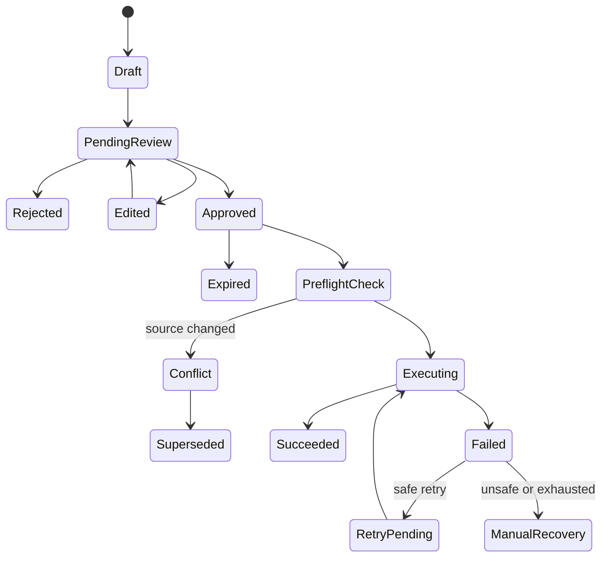

# Approval and Write-Back

## Action classes

| Class | Description | Default behavior |
|---|---|---|
| A0 | Read, calculate or draft with no external side effect | Automatic |
| A1 | Low-risk notification or internal record update | Automatic only under approved policy |
| A2 | External operational update with limited delivery impact | Human approval |
| A3 | Baseline, customer, financial, ownership or executive-impacting action | Higher authority; mostly out of Release 1 |

## Release 1 examples

| Action | Class | Default |
|---|---:|---|
| Read Jira issue | A0 | Automatic |
| Calculate blocker age | A0 | Automatic |
| Draft owner question | A0 | Automatic |
| Send routine update request | A1 | Automatic when cadence activated |
| Send PM escalation | A1/A2 | Policy-controlled |
| Add confirmed Jira comment | A2 | PM or configured approver |
| Update configured non-baseline field | A2 | PM or configured approver |
| Change forecast date | A2/A3 | PM approval; customer policy |
| Change baseline date | A3 | Not automated |
| Send customer-facing status | A3 | Not automated in R1 |
| Change budget | A3 | Not automated |
| Mark issue Done | A3 | Not automated in R1 |

## Approval diff

The approval page must show:

```text
Target system and record
Current source revision
Current value
Proposed value
Original human response
Extracted interpretation
Reason for change
Evidence
Requesting user or workflow
Required approver
Other side effects
Expiry
```

## Approval lifecycle



## Preflight checks

Immediately before execution:

- Confirm proposal is approved and not expired.
- Confirm approver authority remains valid.
- Confirm target record is the expected project and source.
- Confirm connector permission.
- Confirm operation and field are allowlisted.
- Compare current source revision or value with approval base.
- Confirm idempotency key has not already succeeded.
- Confirm shadow mode is not active.
- Confirm customer data policy allows the action.

## Action receipt

Every attempt must record:

- Receipt ID
- Proposal ID
- Customer, project and target record
- Previous and proposed values
- Original response and evidence references
- Requesting actor
- Approver and approval timestamp
- Executing service identity
- Connector operation
- Attempt count
- Result
- External record revision or returned identifier
- Error classification
- Correlation ID
- Timestamps

## Failure behavior

- Authentication or permission failure: stop and notify administrator.
- Rate limit: retry after the source-provided interval.
- Network or safe server failure: bounded retry.
- Validation failure: return to reviewer.
- Source changed: block and generate a new diff.
- Unknown outcome: reconcile before retrying.
- Permanent failure: create manual recovery item.

## Prohibited behavior

- No generic `update_anything` tool.
- No silent field mapping.
- No write based only on an unconfirmed AI interpretation.
- No baseline or financial change in Release 1.
- No automatic issue completion in Release 1.
- No action that exceeds the user’s or service policy’s scope.
