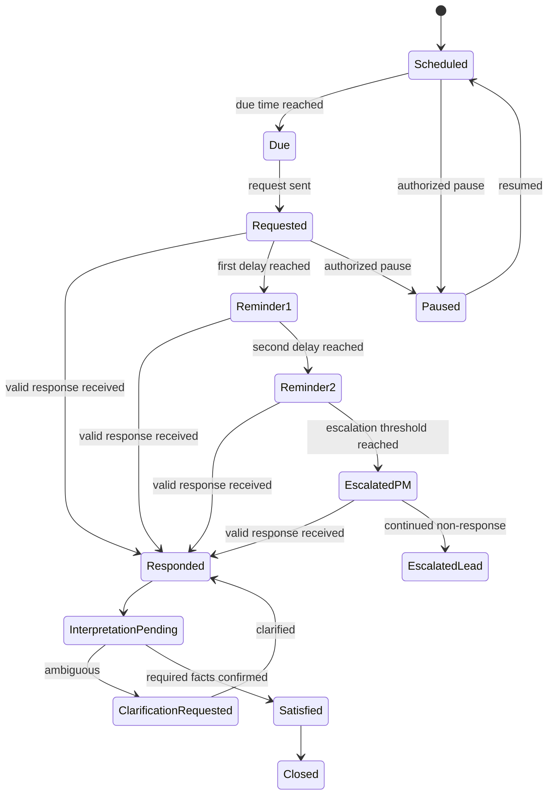

# Update Cadence and Escalation

## Update obligation

An update obligation defines:

- Scope: portfolio, project, milestone, risk or work item
- Required facts
- Responsible person
- Backup or delegate
- Due time and time zone
- Freshness rule
- Reminder stages
- Escalation stages
- Quiet hours and business calendar
- Accepted response channels
- Closure criteria
- Action policy

## State model

## Default Release 1 policy

A customer may change this policy.

| Stage | Example timing | Recipient |
|---|---|---|
| Initial request | At due time | Responsible owner |
| Reminder 1 | 1 business day later | Responsible owner |
| Reminder 2 | 2 business days later | Responsible owner |
| PM escalation | 3 business days later | Owner and PM |
| Team-lead escalation | 5 business days later | Owner, PM and configured lead |

Leadership escalation is not enabled by default.

## Request quality

A request must state:

- Why the update is needed
- What the product already knows
- What is missing or stale
- Relevant previous commitment
- Due time
- Quick response choices where appropriate
- How the response will be used
- Whether a proposed source-system update may follow

## Stop conditions

Pending reminders must stop when:

- A valid response satisfies the obligation.
- An authorized person closes the obligation.
- The project is completed, cancelled or placed on an exempt state.
- A delegate takes ownership.
- The obligation is paused.
- The source is updated and the freshness rule is satisfied.

A partial response stops only the reminders for facts it satisfies.

## Time and calendar behavior

- Use the recipient’s time zone when available.
- Otherwise use project or customer default time zone.
- Do not send routine reminders during configured quiet hours.
- Support business-day calculations.
- Record daylight-saving behavior through standard time-zone identifiers.
- Later releases should support customer holiday calendars.

## Absence and delegation

A recipient may:

- Mark absent until a date
- Nominate an authorized delegate
- State that the request does not apply
- Ask the PM to reassign the obligation

These actions require an audit record and may require approval.

## Escalation guardrails

- Do not publicly shame recipients.
- Do not characterize a non-response as poor performance.
- Include project impact, not only lateness.
- Avoid repeatedly notifying leadership.
- Deduplicate overlapping obligations.
- Allow PMO override.
- Preserve the complete request and response history.
