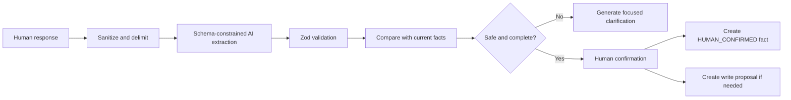

# AI and Grounding Architecture

## Objective

Use AI where language understanding adds value while keeping facts, calculations, permissions and actions governed by normal software.

## AI use cases

- Interpret free-text project updates
- Extract proposed facts
- Draft contextual clarification questions
- Draft role-specific recommendations
- Summarize relevant evidence
- Explain delay causes and consequences
- Draft management narratives
- Classify candidate content for further rule or human review

## Non-AI responsibilities

- Authorization
- Source authority
- Freshness
- Date calculations
- Schedule variance
- Blocker age
- Reminder timing
- Risk and action classes
- Approval requirements
- External-write eligibility
- Idempotency
- Final fact classification

## Leadership answer pipeline

```mermaid
flowchart LR
    Q[Authorized Question] --> Scope[Resolve permitted scope]
    Scope --> Facts[Load structured facts]
    Facts --> Signals[Load deterministic signals]
    Signals --> Evidence[Retrieve relevant evidence]
    Evidence --> Authority[Apply authority and freshness]
    Authority --> Claims[Create structured claim candidates]
    Claims --> LLM[Draft explanation]
    LLM --> Validate[Validate schema and citations]
    Validate --> Guard[Grounding and access guard]
    Guard --> Answer[Stream answer + evidence]
```



## Claim object

```json
{
  "claimText": "Integration testing started nine days late.",
  "provenance": "SYSTEM_VERIFIED",
  "conflict": "NONE",
  "classification": "SYSTEM_VERIFIED",
  "assessedAt": "2026-08-28T12:00:00Z",
  "policyRevision": "authority-v1",
  "factIds": ["fact-version-id"],
  "evidenceIds": ["evidence-id"],
  "freshness": "CURRENT",
  "confidence": "HIGH",
  "timeScope": {
    "from": "2026-08-19",
    "to": "2026-08-28"
  }
}
```

The LLM may improve wording but may not add unsupported material claims.

## Update extraction pipeline



## Provider abstraction

Customer configuration contains:

- Provider type
- Base endpoint
- Model or deployment name
- Secret reference
- Embedding provider and model
- Allowed data classifications
- Retention policy
- Cost or usage limits
- Fallback policy
- Timeout and retry policy

Supported directions:

- OpenAI
- Azure OpenAI
- Anthropic
- AWS Bedrock
- Google Vertex AI
- Approved OpenAI-compatible private endpoint
- Local model endpoint where quality is sufficient
- No-AI deterministic mode

## Model routing

Use simpler models for:

- Structured extraction
- Template drafting
- Short clarification questions

Use stronger reasoning models for:

- Multi-source leadership explanations
- Complex conflict summaries
- Portfolio-level recommendations

Model selection must remain configurable and cost-observable.

## Prompt management

Prompts must be:

- Versioned in source control
- Associated with a purpose
- Reviewed for data minimization
- Recorded by version in AI-run metadata
- Tested against golden scenarios
- Protected from source-content instruction injection

## Grounding validation

Before presenting a material answer:

- Validate output schema.
- Confirm every material factual sentence maps to a claim object.
- Confirm evidence belongs to the authorized scope.
- Confirm evidence remains available and current.
- Detect unsupported numeric or date claims.
- Mark inferences.
- Include unresolved conflicts.
- Refuse or qualify the answer when evidence is insufficient.

## No private chain-of-thought dependency

The product records:

- User request
- Selected facts
- Tool calls
- Prompt version
- Structured output
- Validation result
- Final claims
- Action or answer summary

It must not require storage or exposure of private model chain-of-thought.

## Evaluation

See:

- `docs/05-quality/AGENT_EVALUATION_STRATEGY.md`
- `docs/05-quality/GOLDEN_TEST_SCENARIOS.md`

## Claim release boundary

Claim provenance, freshness, conflict and derived display classification follow
ADR-009. The model cannot select them. SSE may emit progress before validation;
material claims stream only after current authorization, evidence and grounding
validation. Snapshots preserve their assessed state without granting future access.
