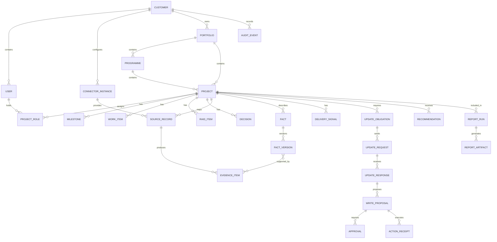

# Data Model

## Data-model principles

- Use stable internal UUIDs.
- Retain external source IDs separately.
- Version material facts.
- Keep current projections for fast reads and history for audit.
- Store structured facts as typed columns or validated JSON where appropriate.
- Use embeddings only for unstructured retrieval.
- Treat source content as untrusted.
- Avoid database structures tied to one customer’s Jira configuration.

## High-level entity model

## Core tables

### `projects`

Suggested fields:

- `id`
- `customer_id`
- `portfolio_id`
- `programme_id`
- `project_code`
- `name`
- `description`
- `workstream`
- `business_unit`
- `sponsor_id`
- `project_manager_id`
- `priority`
- `business_impact`
- `effort_size`
- `phase`
- `lifecycle_status`
- `baseline_start_date`
- `baseline_end_date`
- `forecast_end_date`
- `actual_end_date`
- `reported_rag`
- `management_attention_state`
- `last_verified_at`
- `created_at`
- `updated_at`

### `source_records`

- `id`
- `connector_instance_id`
- `external_type`
- `external_id`
- `external_url`
- `external_revision`
- `project_id`
- `normalized_hash`
- `observed_at`
- `source_updated_at`
- `raw_payload_reference`
- `deleted_at`

Do not store entire sensitive raw payloads by default when normalized facts are sufficient.

### `facts`

- `id`
- `customer_id`
- `project_id`
- `fact_type`
- `subject_type`
- `subject_id`
- `current_version_id`
- `authority_rule_id`
- `created_at`

### `fact_versions`

- `id`
- `fact_id`
- `value_json`
- `classification`
- `confidence`
- `effective_at`
- `observed_at`
- `verified_at`
- `valid_until`
- `provided_by_user_id`
- `source_record_id`
- `supersedes_version_id`
- `approval_id`
- `created_at`

### `evidence_items`

- `id`
- `customer_id`
- `project_id`
- `source_record_id`
- `evidence_type`
- `title`
- `content_reference`
- `content_hash`
- `excerpt`
- `occurred_at`
- `observed_at`
- `access_classification`
- `embedding`
- `metadata_json`

### `update_obligations`

- `id`
- `project_id`
- `policy_id`
- `responsible_user_id`
- `due_at`
- `state`
- `required_fact_types`
- `last_request_at`
- `next_action_at`
- `satisfied_at`
- `closed_reason`
- `version`

### `update_requests`

- `id`
- `obligation_id`
- `channel`
- `recipient`
- `message_version`
- `sent_at`
- `delivery_status`
- `correlation_id`

### `update_responses`

- `id`
- `request_id`
- `provided_by_user_id`
- `raw_text`
- `received_at`
- `structured_interpretation_json`
- `interpretation_status`
- `confirmed_at`
- `evidence_item_id`

### `write_proposals`

- `id`
- `project_id`
- `target_connector_id`
- `target_record_id`
- `operation`
- `current_value_json`
- `current_revision`
- `proposed_value_json`
- `reason`
- `risk_class`
- `state`
- `expires_at`
- `idempotency_key`
- `created_by_type`
- `created_by_id`
- `created_at`

### `approvals`

- `id`
- `proposal_id`
- `approver_user_id`
- `decision`
- `comment`
- `proposal_revision`
- `decided_at`

### `action_receipts`

- `id`
- `proposal_id`
- `attempt`
- `executing_identity`
- `started_at`
- `completed_at`
- `result`
- `external_revision`
- `external_response_reference`
- `error_class`
- `correlation_id`

### `delivery_signals`

- `id`
- `project_id`
- `signal_type`
- `severity`
- `input_facts_json`
- `rule_id`
- `rule_version`
- `explanation`
- `detected_at`
- `resolved_at`

### `audit_events`

- `id`
- `customer_id`
- `project_id`
- `actor_type`
- `actor_id`
- `event_type`
- `object_type`
- `object_id`
- `summary`
- `metadata_json`
- `correlation_id`
- `occurred_at`

## Data integrity

- Unique external record by connector, type and external ID.
- Unique event receipt by connector and external event ID.
- Unique action execution by idempotency key.
- Optimistic version on update obligations and proposals.
- Foreign-key restrictions around audit and receipt deletion.
- Check constraints for classification and state values.
- Tenant/customer key included in every business table.
- Project scope verified before joining evidence into user-facing queries.

## Storage for unstructured content

Release 1 may store small permitted excerpts in PostgreSQL. Larger documents or source payloads should use customer-controlled object storage with encrypted references.

## Embeddings

Embeddings may support retrieval for:

- Comments
- Meeting notes
- Email
- Report narratives
- Documents

Embeddings must not determine permissions, source authority or current structured facts.
