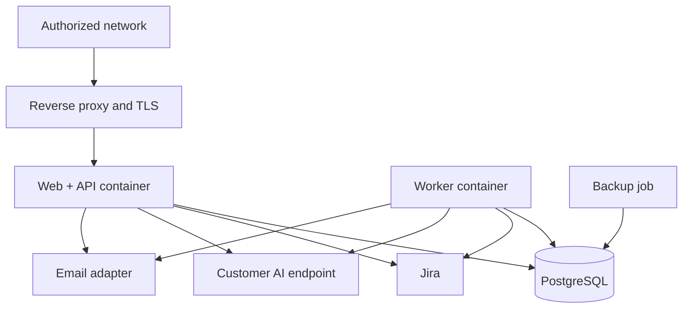

# Deployment and Operations

## Deployment objective

Provide a repeatable customer-hosted package that can be operated with limited vendor involvement.

## Default Release 1 topology

## Components

- Reverse proxy or customer ingress
- Web/API application
- Background worker
- PostgreSQL or customer-managed PostgreSQL
- Backup job
- Optional object storage
- Optional document-extraction sidecar in later releases
- Optional observability integration

## Packaging

Each release must provide:

- Versioned signed container images
- `docker-compose.yml` reference
- Environment and configuration examples
- Configuration schema
- Database migrations
- Backup script or procedure
- Restore procedure
- Upgrade script or runbook
- Rollback or recovery runbook
- Health checks
- Release notes
- SBOM
- Third-party notices

## Configuration separation

### Non-secret

- Customer name
- Feature flags
- Field mappings
- Cadence policies
- Source authority
- Report templates
- Terminology
- Retention periods
- AI routing policy without secret values

### Secret

- Database password
- OIDC client secret
- Connector credentials
- AI API keys
- Encryption keys
- Email credentials
- Signing secrets

## Database options

- Bundled supported PostgreSQL for demonstrations and smaller deployments
- Customer-managed PostgreSQL for production
- AWS RDS, Azure Database for PostgreSQL, Google Cloud SQL, Supabase or standard self-hosted PostgreSQL where compatible

Do not require Supabase-specific Auth, Realtime or Edge Functions.

## Environment profiles

### Local development

- Docker Compose
- Local PostgreSQL
- Mock Jira and AI adapters
- Seeded synthetic data
- Development login

### Demonstration

- Protected hosted deployment
- Synthetic data
- Read-only or controlled demo Jira site
- Small AI usage allowance
- Automated reset script

### Customer production

- Customer OIDC
- Customer PostgreSQL
- Customer secret manager where available
- Customer connector registrations
- Customer AI endpoint
- Customer logging and backup

## Health checks

Expose:

- Liveness
- Readiness
- Database connectivity
- Worker heartbeat
- Queue depth
- Connector health summary
- Last successful synchronization
- Migration version

Do not expose sensitive configuration in health endpoints.

## Backup and restore

Minimum:

- Daily database backup
- Configurable retention
- Encrypted backup location
- Periodic restore test
- Backup before upgrade
- Restore runbook
- Evidence and audit consistency validation after restore

## Upgrade

1. Review release notes and compatibility.
2. Backup database and configuration.
3. Pull signed images.
4. Run preflight.
5. Apply migration.
6. Start services.
7. Run smoke and connector checks.
8. Monitor.
9. Use documented recovery if validation fails.

## Observability

Initial:

- Structured JSON logs
- Correlation IDs
- Basic application metrics
- Worker queue and failure metrics
- Connector health
- AI latency and usage metadata

Enterprise:

- OpenTelemetry export
- Customer SIEM
- Central metrics and alerting
- Audit export

## Operational ownership

| Area | Standard owner |
|---|---|
| Infrastructure | Customer |
| Identity and user lifecycle | Customer |
| Connector credentials | Customer |
| AI provider and usage | Customer |
| Product images and migrations | Vendor |
| Product defects | Vendor under support |
| Customer-specific configuration | Joint during implementation, customer after handover |
| Backups | Customer, unless managed service contracted |

## Restore quarantine

Restored deployments start with outbound notifications and writes disabled,
regardless of the saved configuration. A backup may predate an external action
that has already succeeded. Reconcile pending/uncertain proposals against exact
remote targets and stable markers before enabling execution. Suppress completed
actions and route unprovable outcomes to manual recovery. A restore drill must
include a comment completed after backup and prove it is not replayed. Resume
requires an authorized operator's recorded review of reconciliation results.
