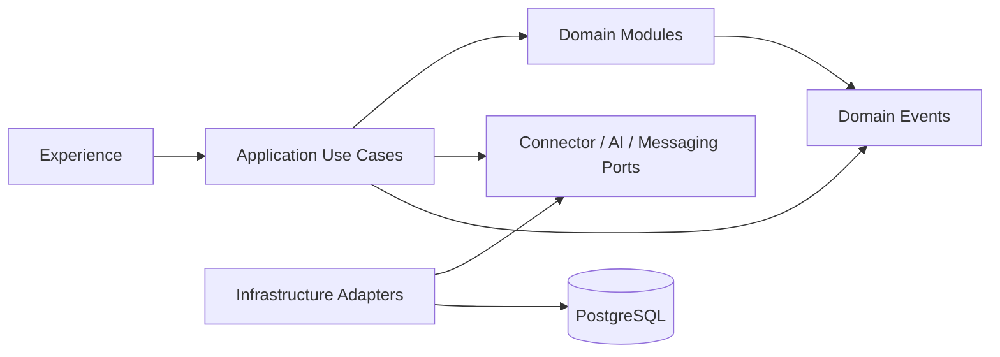

# Domain Architecture

## Domain modules

### Identity and Access

Responsibilities:

- User and service identities
- Role assignments
- Portfolio/project scopes
- Permission evaluation
- Approval authority

### Portfolio and Project

Responsibilities:

- Portfolio, programme and project hierarchy
- Project attributes
- Owners and stakeholders
- Project lifecycle
- Workstream, business unit and priority

### Delivery

Responsibilities:

- Sprints
- Milestones
- Work items
- Dates and forecasts
- Progress
- Relationships

### RAID and Decisions

Responsibilities:

- Risks
- Assumptions
- Issues
- Dependencies
- Decisions
- Actions
- Owners and due dates

### Source Integration

Responsibilities:

- Connector instances
- Field mappings
- External identities
- Source records
- Synchronization cursors
- Connector health

### Evidence

Responsibilities:

- Fact versions
- Evidence references
- Fact classification
- Freshness
- Human confirmation
- Conflict state
- Source authority

### Assurance

Responsibilities:

- Completeness checks
- Freshness checks
- Delivery signals
- Contradiction rules
- Signal history
- Management-attention state

### Engagement

Responsibilities:

- Update obligations
- Requests
- Responses
- Clarifications
- Reminders
- Escalation
- Delegation and absence

### Advice

Responsibilities:

- Role-specific recommendation rules
- Recommendation priority
- Rationale
- Acceptance or dismissal
- Action conversion

### Approval and Action

Responsibilities:

- Action classification
- Proposals
- Approval diff
- Approval records
- Preflight checks
- External execution
- Action receipts

### Q&A and Reporting

Responsibilities:

- Authorized question scope
- Claim construction
- Evidence citation
- Report runs
- Snapshots
- Audience templates

### Administration

Responsibilities:

- Customer configuration
- AI policies
- Retention
- Branding
- Feature flags
- Product licence metadata

## Dependency direction

Domain modules must not depend on external SDKs.

## Aggregate examples

### Project aggregate

- Project
- Project roles
- Project attributes
- Lifecycle state
- Policy references

### Update obligation aggregate

- Obligation
- Required facts
- Responsible person
- Request history
- Reminder/escalation state
- Satisfaction state

### Write proposal aggregate

- Target
- Current state
- Proposed state
- Evidence
- Risk class
- Required approver
- Approval and execution state

### Report run aggregate

- Scope
- Reporting period
- Fact-set revision
- Draft
- Approval
- Generated artifacts
- Snapshot metadata

## Domain event examples

- `SourceRecordObserved`
- `FactVersionCreated`
- `FactConflictDetected`
- `ProjectUpdateBecameDue`
- `UpdateRequestSent`
- `UpdateResponseReceived`
- `UpdateInterpretationProposed`
- `ClarificationRequested`
- `UpdateObligationSatisfied`
- `DeliverySignalChanged`
- `RecommendationCreated`
- `WriteProposalApproved`
- `ExternalWriteRequested`
- `ExternalWriteSucceeded`
- `ExternalWriteFailed`
- `ReportSnapshotApproved`

## Status separation

The model must separate:

- Source work-item state
- Reported project RAG
- Calculated delivery signals
- PMO management-attention status
- Update-obligation status
- Approval status
- Connector health

Combining these into one status field would make the product unreliable and hard to explain.
