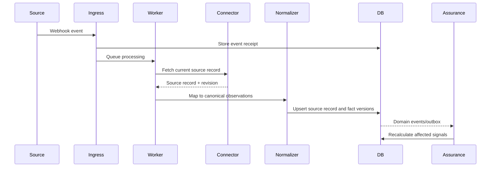
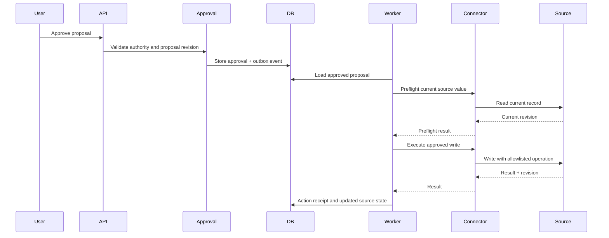

# Integration Architecture

## Connector contract

Each connector implements a stable first-party interface.

```typescript
interface Connector {
  testConnection(): Promise<ConnectionTestResult>;
  discoverScopes(): Promise<ScopeSummary>;
  pullChanges(cursor?: string): Promise<ChangePage>;
  getRecord(ref: ExternalRecordRef): Promise<ExternalRecord>;
  getDeepLink(ref: ExternalRecordRef): string | null;
  proposeWrite(input: ProposedConnectorWrite): Promise<ValidatedWrite>;
  executeWrite(input: ApprovedConnectorWrite): Promise<ConnectorWriteResult>;
  reconcileWrite(receipt: PendingReceipt): Promise<ConnectorWriteResult>;
}
```

The exact interface may change during implementation, but domain modules must not import external SDK types.

## Synchronization pattern



Scheduled reconciliation uses the same normalizer path.

## Jira Release 1 integration

Read:

- Projects
- Boards
- Sprints
- Issues
- Status
- Assignee
- Due date
- Selected custom fields
- Comments
- Changelog
- Issue links
- Epic/parent relationships

Write:

- Approved comment
- Allowlisted non-baseline field writes deferred to R2
- No automatic completion
- No automatic baseline change

Authentication:

- OAuth 2.0 3LO is the intended Jira Cloud authorization mechanism, subject to OD-013.
- Do not collect API tokens or instruct customers to create individual 3LO apps. Use only an approved distributable-app model.
- The OAuth callback must match the registered app callback; callback reachability and client-secret delivery for customer-hosted installs are unresolved.
- Encrypted refresh tokens
- Atomic refresh-token rotation
- Read-only mode
- Keep public onboarding and live activation disabled until OD-013 is resolved.

### Current implementation boundary

**Current authorization and data gates:** Atlassian's [3LO guidance](https://developer.atlassian.com/cloud/jira/platform/oauth-2-3lo-apps/) prohibits collecting API tokens or directing customers to create individual OAuth apps and recommends a single distributable app. The OAuth `redirect_uri` must match the callback registered for that app. This product's customer-hosted deployment and no-vendor-control-plane requirement leave callback routing and client-secret distribution open (OD-013). No public authorization callback, onboarding UI, customer-specific app setup or live activation is enabled. Jira comment endpoints return comment bodies alongside metadata; comment reads are disabled until OD-014 approves retention, access, visibility, redaction and deletion rules.


`@pdaa/connectors-jira` is the first Jira Cloud adapter. Its caller supplies a
trusted, explicit mapping between internal project UUIDs and Jira project keys,
plus a field allowlist and canonical fact types. Discovery probes only the
configured Jira project keys; issue search uses enhanced JQL search constrained
to those keys, and Jira remains responsible for Browse Projects and issue-level
security filtering. Each returned issue is checked again against the same
project mapping before it can cross the connector port. Only selected scalar
fields become typed proposals. Source values remain proposals; the adapter does
not publish canonical facts or imply source authority.

The Jira runtime candidate invokes the adapter through a bounded internal task
and a one-minute worker dispatch. It stores OAuth tokens in the configured
credential keyring and serializes refresh-token rotation with a 60-second lease
and operation/revision fence. A verified administrator-configured webhook records
the raw-body digest and queues durable reconciliation; the webhook payload never
becomes a proposal. The runtime rereads Jira and commits typed proposals, cursor,
health and receipt rows only after rechecking the current mapping and exact active
source/project grants.

There is no public OAuth authorization callback or onboarding UI in this
increment; OAuth credentials must be supplied through a separately authorized
operator handoff. Jira writes and canonical fact publication remain disabled.
The read-only adapter's bounded entity projections cover issue links only when
both endpoints map to the active scope, changelog items only for explicitly
mapped fields, and board/sprint records only through explicit board-to-project
mappings. Board and sprint reads require the configured Jira Software scopes;
board enumeration does not widen project selection. Linked and historical values
remain proposals and keep their source IDs and content revisions.

Comment reads remain disabled under OD-014; spreadsheet import commits save
reviewed proposals only. No live Jira account or production credential has been
activated, and OD-013 still blocks public OAuth onboarding and live activation.

## Spreadsheet integration

The spreadsheet connector must:

- Accept `.xlsx` or `.csv`
- Require an explicit field mapping
- Preview validation errors
- Retain source file and sheet metadata
- Calculate a stable row identity
- Detect changed rows
- Avoid treating formulas or presentation text as authoritative without mapping
- Store import run and row-level results
- Support dry-run import

PowerPoint is not a Release 1 source.

## Messaging abstraction

Channels implement:

```text
send_update_request
send_reminder
send_escalation
send_digest
receive_response
verify_sender
resolve_user
```

Release 1 uses email notification plus a secure response page. Microsoft Graph and Teams adapters follow without changing Engagement domain logic.

## Outbound action pattern



## Idempotency

Use:

- Webhook event IDs or stable hashes
- Source record revision
- Transactional outbox IDs
- Write proposal idempotency keys
- Receipt reconciliation after unknown outcomes

## Rate limits and backoff

- Respect `Retry-After`.
- Use bounded exponential backoff for safe failures.
- Isolate connector quotas by customer.
- Avoid repeated full-project scans.
- Surface sustained throttling as connector-health degradation.

## Future MCP interface

MCP may expose controlled product capabilities such as:

- `get_verified_project_status`
- `explain_project_delay`
- `get_decisions_required`
- `request_project_update`
- `get_missing_updates`

MCP must call application services. It must not become a direct bypass to Jira or the database.

## R1 side-effect recovery contract

The comment marker, comparison base, append-only attempt events, atomic execution
claim and unknown-outcome handling are defined in APPROVAL_AND_WRITEBACK.md.
Adapters must not treat a timeout as safe to retry. All retries return through
preflight. Comment append is not a field-level compare-and-swap operation.
