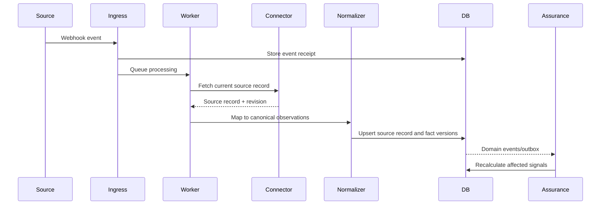
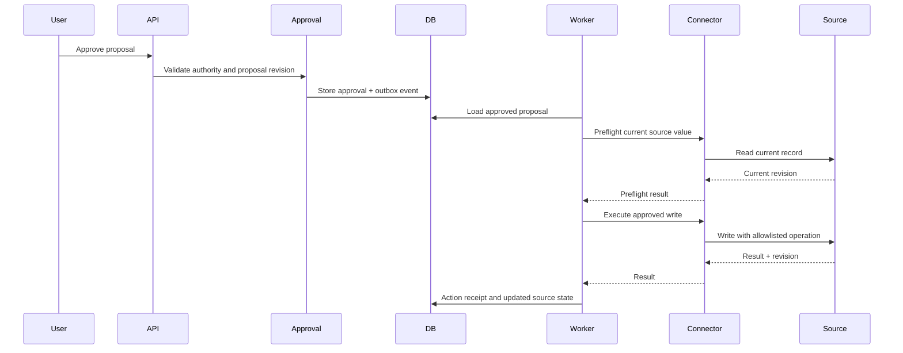

# Integration Architecture

## Connector contract

Each connector implements a stable first-party interface.

```typescript
interface Connector {
  testConnection(): Promise<ConnectionTestResult>;
  discoverScopes(): Promise<ScopeSummary>;
  pullChanges(cursor?: string): Promise<ChangePage>;
  getRecord(ref: ExternalRecordRef): Promise<ExternalRecord>;
  getDeepLink(ref: ExternalRecordRef): string | null;
  proposeWrite(input: ProposedConnectorWrite): Promise<ValidatedWrite>;
  executeWrite(input: ApprovedConnectorWrite): Promise<ConnectorWriteResult>;
  reconcileWrite(receipt: PendingReceipt): Promise<ConnectorWriteResult>;
}
```

The exact interface may change during implementation, but domain modules must not import external SDK types.

## Synchronization pattern



Scheduled reconciliation uses the same normalizer path.

## Jira Release 1 integration

Read:

- Projects
- Boards
- Sprints
- Issues
- Status
- Assignee
- Due date
- Selected custom fields
- Comments
- Changelog
- Issue links
- Epic/parent relationships

Write:

- Approved comment
- Allowlisted non-baseline field writes deferred to R2
- No automatic completion
- No automatic baseline change

Authentication:

- OAuth 2.0 3LO preferred for production
- Customer-owned app registration or approved integration account
- Encrypted refresh tokens
- Atomic refresh-token rotation
- Read-only mode

## Spreadsheet integration

The spreadsheet connector must:

- Accept `.xlsx` or `.csv`
- Require an explicit field mapping
- Preview validation errors
- Retain source file and sheet metadata
- Calculate a stable row identity
- Detect changed rows
- Avoid treating formulas or presentation text as authoritative without mapping
- Store import run and row-level results
- Support dry-run import

PowerPoint is not a Release 1 source.

## Messaging abstraction

Channels implement:

```text
send_update_request
send_reminder
send_escalation
send_digest
receive_response
verify_sender
resolve_user
```

Release 1 uses email notification plus a secure response page. Microsoft Graph and Teams adapters follow without changing Engagement domain logic.

## Outbound action pattern



## Idempotency

Use:

- Webhook event IDs or stable hashes
- Source record revision
- Transactional outbox IDs
- Write proposal idempotency keys
- Receipt reconciliation after unknown outcomes

## Rate limits and backoff

- Respect `Retry-After`.
- Use bounded exponential backoff for safe failures.
- Isolate connector quotas by customer.
- Avoid repeated full-project scans.
- Surface sustained throttling as connector-health degradation.

## Future MCP interface

MCP may expose controlled product capabilities such as:

- `get_verified_project_status`
- `explain_project_delay`
- `get_decisions_required`
- `request_project_update`
- `get_missing_updates`

MCP must call application services. It must not become a direct bypass to Jira or the database.

## R1 side-effect recovery contract

The comment marker, comparison base, append-only attempt events, atomic execution
claim and unknown-outcome handling are defined in APPROVAL_AND_WRITEBACK.md.
Adapters must not treat a timeout as safe to retry. All retries return through
preflight. Comment append is not a field-level compare-and-swap operation.
