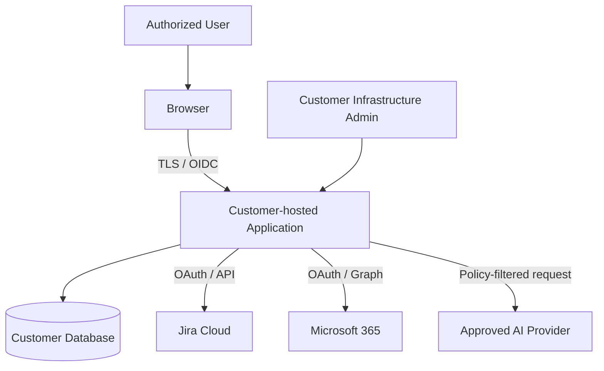

# Security and Privacy Architecture

## Security objectives

- Prevent cross-project and cross-customer data exposure.
- Prevent unauthorized external changes.
- Protect connector and AI credentials.
- Ensure AI cannot bypass permissions or policy.
- Preserve complete material-action audit.
- Minimize data sent outside the customer environment.
- Support customer security review and controlled deployment.

## Trust boundaries

Each external system is a separate trust boundary.

## Data classification

Example classes:

| Class | Example | AI routing default |
|---|---|---|
| Public | Public product metadata | Allowed |
| Internal | Project names, normal status | Customer policy |
| Confidential | Customer delivery details, risks | Private/approved endpoint only |
| Restricted | Credentials, sensitive personal or regulated data | Never send to general AI provider |

## Authentication

- OIDC for production users
- Short-lived application sessions
- Secure cookie or approved bearer-token handling
- CSRF protection where applicable
- MFA enforced by customer identity provider
- Service identities separated from human identities

## Authorization

- Server-side checks
- Customer/tenant scope in every business query
- Portfolio and project scopes
- Evidence-level access
- Approval authority by action and project
- No implicit business access for infrastructure administrators
- Scheduled job policy independent of previous user sessions

## Secrets

- External secret references preferred in enterprise deployments
- Encrypted connector tokens at rest
- Atomic Jira refresh-token rotation
- No secrets in source control, logs or error responses
- Rotation and revocation procedures
- Environment variables accepted for simple deployment but documented carefully

## AI security

- Narrow tool schemas
- Independent argument validation
- No arbitrary SQL, URL or connector calls
- Source content delimited as untrusted data
- Data minimization and redaction
- Provider allowlist
- Model and endpoint configuration validation
- Prompt versioning
- Output schema validation
- Evidence and authorization validation after generation

## External write security

- Allowlisted operations and fields
- Approval by authorized role
- Proposal expiry
- Source revision recheck
- Idempotency
- Complete action receipt
- Shadow mode
- Safe retry
- Manual recovery for unknown outcome

## Logging

Do not log:

- Passwords
- API keys
- OAuth refresh tokens
- Session tokens
- Full restricted source payloads
- Unredacted sensitive AI prompts by default

Log:

- Correlation ID
- Customer and project IDs where allowed
- Actor type
- Operation
- Result
- Error class
- Timing
- Source record ID
- Prompt version and model metadata
- Receipt ID

## Privacy roles

In customer-hosted deployments, the customer normally determines the purposes and means of project-data processing. Contractual roles may vary when the vendor accesses production data for support. The final data-processing terms must reflect the real support and telemetry model.

## Retention and deletion

- Configurable retention by data class
- Legal-hold capability considered for enterprise releases
- Audit retention separated from transient AI data
- Deletion jobs recorded and reviewable
- Embeddings deleted or rebuilt with their source evidence
- Backups follow customer retention

## Security testing

- Threat modeling
- SAST and dependency scanning
- Container scanning
- Secret scanning
- Authorization tests
- Prompt-injection tests
- Webhook replay tests
- SSRF and URL-validation tests
- File-upload validation
- Write-concurrency tests
- Cross-project Q&A leakage tests

## Initial compliance posture

Release 1 should be designed to support enterprise security review but must not claim certifications such as SOC 2 or ISO 27001 until achieved.
