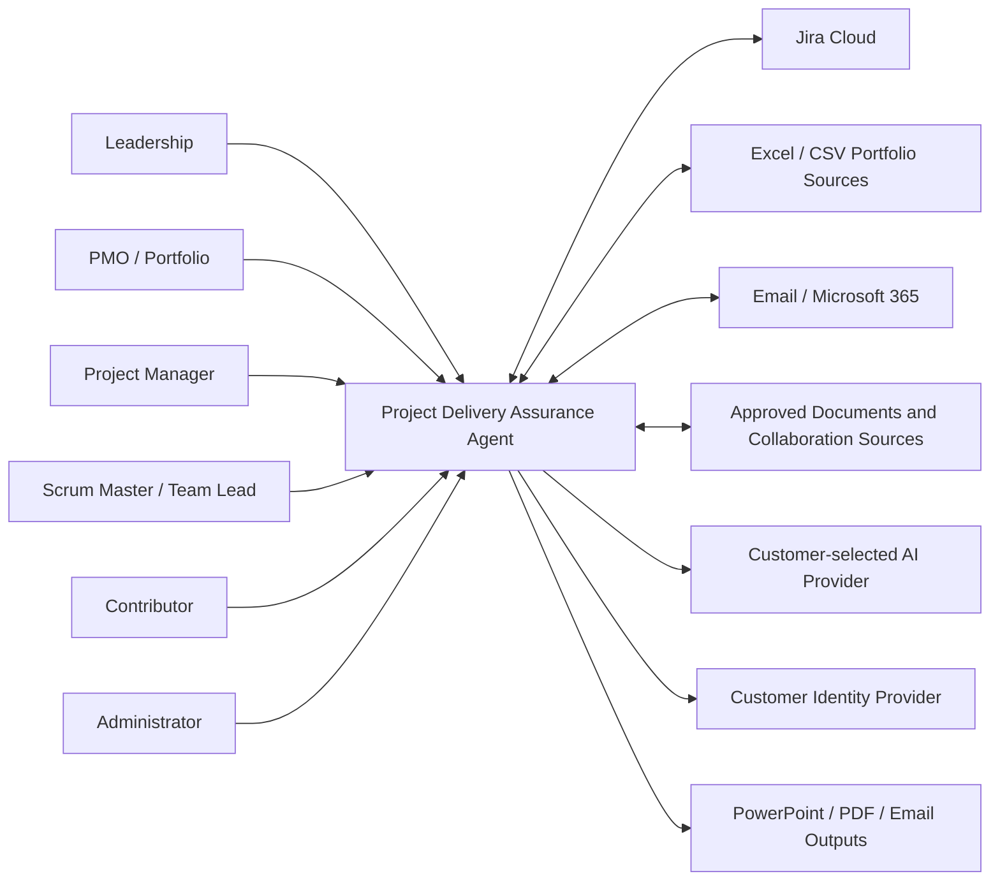
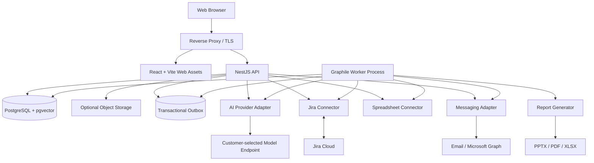

# Solution Architecture

## 1. Architecture objective

Provide an enterprise-ready but low-maintenance application that can be deployed inside a customer environment, connect to existing project systems, coordinate delivery updates and answer questions using governed evidence.

## 2. Architecture principles

- Modular monolith before microservices
- One primary language
- PostgreSQL as operational centre
- Deterministic business rules
- Bounded AI tools
- Field-level source authority
- Append-only material audit
- Customer-controlled identity, infrastructure and AI routing
- Configuration instead of customer forks
- Safe read-only and shadow modes
- External systems accessed through isolated connectors
- Formal events and idempotency around side effects

## 3. System context

## 4. Container architecture

The API and worker use the same domain packages and may be built from the same source repository and image family, with separate process commands.

## 5. Logical layers

### Experience

- Role workspaces
- Portfolio and project dashboards
- Update pages
- Approval pages
- Leadership Q&A
- Administration
- Report preview

### Application

- Use-case orchestration
- Authorization
- Transaction boundaries
- Commands and queries
- Notifications
- Background-job coordination

### Domain

- Canonical Project Model
- Evidence and source authority
- Update obligations
- Health signals
- Recommendations
- Approval policies
- Action receipts

### Infrastructure

- PostgreSQL
- Graphile Worker
- Connector SDK wrappers
- AI-provider adapter
- Email and report generation
- Logging and telemetry
- Container deployment

## 6. Deployment boundary

A standard customer deployment owns:

- Application containers
- PostgreSQL database
- Customer configuration
- Identity-provider registration
- Jira and Microsoft connector credentials
- AI provider key or private endpoint
- Backup location
- Logs and monitoring

The product vendor supplies:

- Signed images
- Migrations
- Configuration schema
- Deployment scripts
- Release notes
- Support and upgrade packages
- Optional source access according to contract

## 7. Synchronous and asynchronous work

### Synchronous

- Authentication
- Dashboard queries
- Update submission
- Approval
- Leadership question initiation
- Configuration validation

### Asynchronous

- Source synchronization
- Webhook processing
- Reminder and escalation
- AI extraction where slow
- Leadership answer completion
- Report generation
- External write execution
- Reconciliation
- Retention and maintenance

## 8. Architecture guardrails

- Do not expose the raw database or connector client to AI.
- Do not put source authority in prompts.
- Do not use embeddings for authoritative dates, status, owners, costs or permissions.
- Do not call an LLM for deterministic calculations.
- Do not make external side effects in the same unguarded step as interpretation.
- Do not make the web interface responsible for enforcing permissions.
- Do not create independent customer variants.
