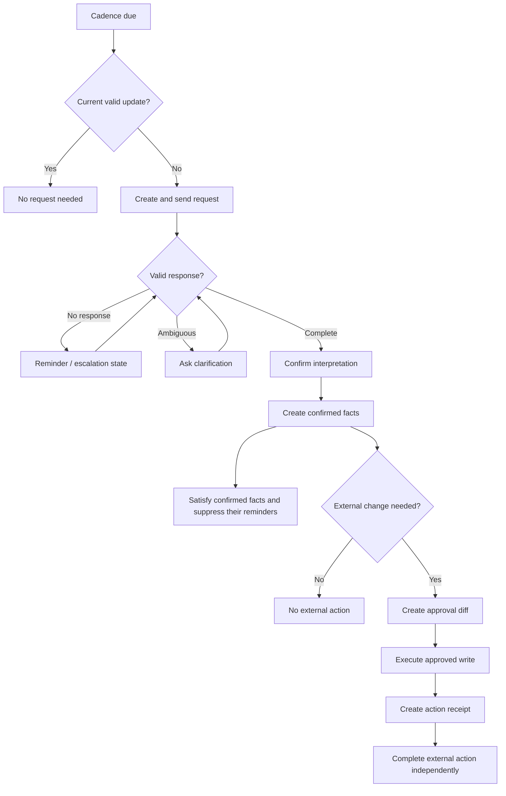

# Workflow Architecture

## Workflow approach

Release 1 uses PostgreSQL-backed business state plus Graphile Worker for scheduled and asynchronous execution.

Graphile Worker triggers work. Domain tables remain the authoritative workflow state.

## Transactional outbox

A business transaction that creates a side effect must:

1. Change domain state.
2. Write an outbox event in the same database transaction.
3. Commit.
4. Let a worker claim and process the event.
5. Record success or failure.
6. Retry only under policy.

This avoids a state where the database says an action happened but no message or connector request was sent.

## Update workflow



## Monitoring workflow

```text
Webhook or scheduled reconciliation
-> current source record
-> normalize observation
-> create fact version
-> evaluate authority and freshness
-> recalculate affected signals
-> create recommendation or update obligation
-> refresh read projections
```

## Q&A workflow

```text
Authorized question
-> scope resolution
-> structured facts
-> deterministic signals
-> evidence retrieval
-> claim construction
-> AI explanation
-> grounding validation
-> answer and optional next action
```

## Report workflow

```text
Report schedule or manual request
-> select scope and reporting period
-> freeze fact-set revision
-> generate draft
-> validate evidence coverage
-> PMO review
-> approval
-> generate PPTX/PDF/email
-> store artifact metadata
-> distribute according to policy
```

## Workflow states must be explicit

Do not use free-text status for critical workflows. State transitions must be validated in domain code.

## Worker concerns

Workers must support:

- Named task types
- Correlation IDs
- Customer isolation
- Bounded retry
- Dead-letter or manual-recovery path
- Job timeout
- Cancellation or supersession
- Observability
- Graceful shutdown
- Idempotency

## Long-running human waits

A workflow waiting days for a response must not hold an application process. It remains represented by durable database state and a scheduled `next_action_at`.

## Future evolution

Temporal or another durable workflow engine may be considered only when:

- Workflows become materially more complex
- Multiple services require coordinated state
- PostgreSQL job handling becomes an operational bottleneck
- Replay, compensation or multi-region needs justify the cost

The decision requires a new ADR and measured evidence.

## Independent satisfaction and dispatch

Commit confirmed facts, satisfied obligation state and reminder suppression in
one transaction. An optional external proposal has an independent lifecycle;
approval delays or connector failures do not keep chasing an already satisfied
information request. Partial/ambiguous replies retain a due clarification action
for unresolved facts. Before dispatch every reminder worker rechecks current
obligation state, owner, policy, quiet hours and shadow mode.
