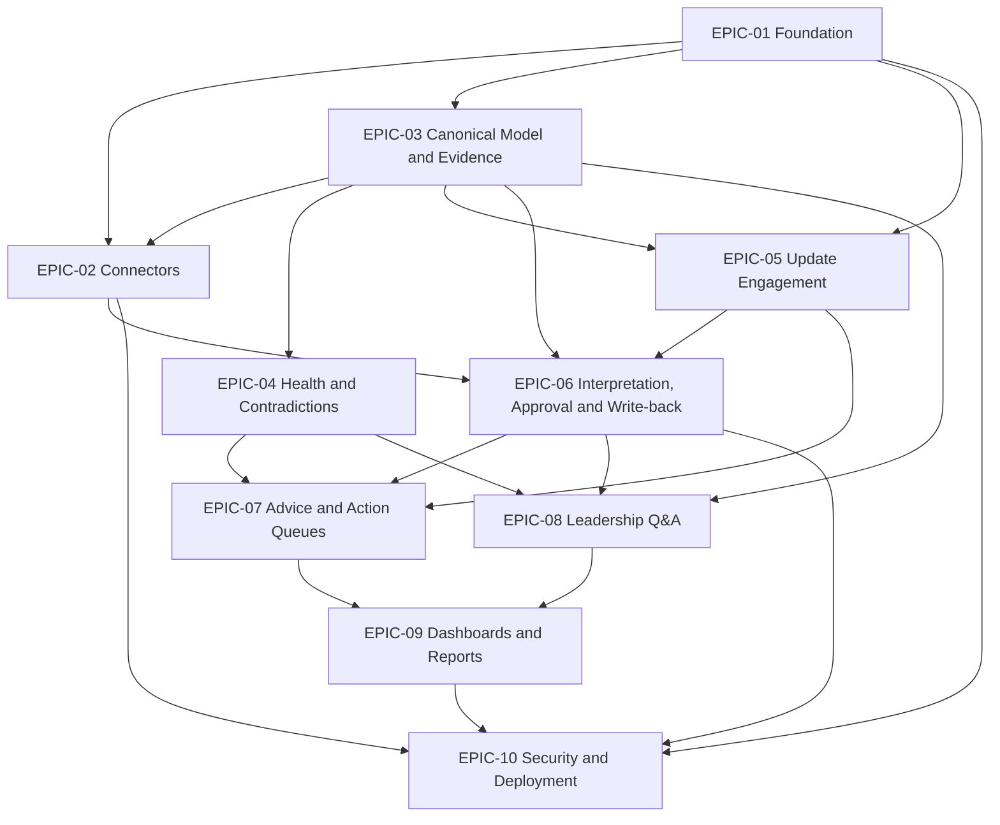

# Release 1 Dependency Map

## Critical path

1. Platform foundation
2. Canonical facts and evidence
3. Jira/spreadsheet ingestion
4. Update obligations
5. Response interpretation and confirmation
6. Approval and Jira write-back
7. Leadership Q&A
8. Dashboard and management snapshot
9. Security and release hardening

## Parallel opportunities

After the foundation:

- Jira connector and spreadsheet connector
- Evidence model and basic web shell
- Health rules and update-message UX after the canonical model
- PowerPoint template and leadership Q&A UI after claim schema is stable
- Security tests throughout rather than at the end

## Hard dependencies

- No leadership answer before fact classification and authorization.
- No write-back before approval, preflight and action receipt.
- No escalation before update-obligation state is durable.
- No final report before report-run fact-set revision exists.
- No customer deployment before backup, restore and secret configuration are documented.

## Foundation security gate

EPIC-01 must deliver production OIDC validation, configurable user/group mappings,
server-enforced project/portfolio scope, service-identity separation, encrypted
credential storage, configuration validation and redacted audit/log output.
Negative tests must deny invalid/expired identities, cross-project direct API
access, revoked scope and production development login. Synthetic demo identity
is explicitly enabled only for local synthetic data. Shadow mode starts enabled.
Real-data ingestion, messaging and write-back depend on this gate. EPIC-10 performs
release verification and hardening of controls already present in every increment.
