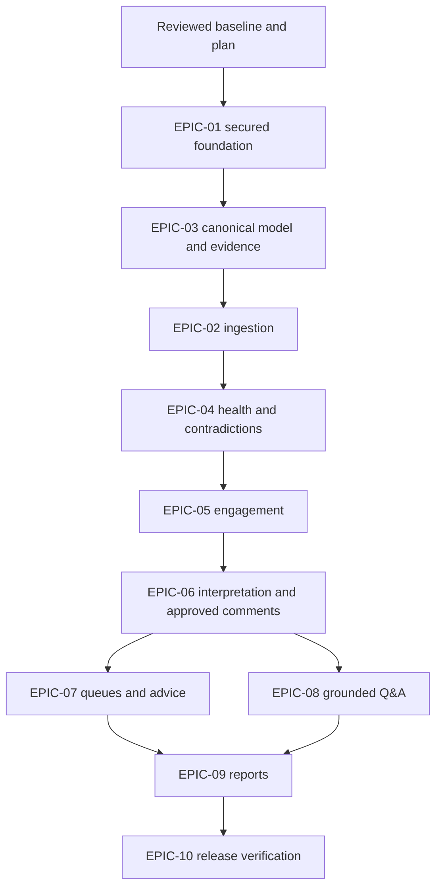

# Release 1 Implementation Master Plan

Status: Approved and merged through PR #3 on 2026-09-06; partial foundation
merged through PR #4. Complete story acceptance remains separately gated.
Owner: Implementation controller
Baseline: `5f37c657293e41627b4e8fe1caf93c52b50bce17`

## Current state and gates

The corrected baseline was approved by a separate non-author reviewer at
`5f37c657293e41627b4e8fe1caf93c52b50bce17`, passed documentation checks and merged
through [PR #2](https://github.com/APReddy-AutoBotz/Project-Delivery-Agent/pull/2). Issue #1 is closed. The independently reviewed
master plan merged through [PR #3](https://github.com/APReddy-AutoBotz/Project-Delivery-Agent/pull/3); four milestones and ten
implementation issues are published. The partial synthetic foundation merged
through [PR #4](https://github.com/APReddy-AutoBotz/Project-Delivery-Agent/pull/4) after remote documentation and application checks.

The user explicitly approved publication to this public destination. Earlier
local work proceeded with synthetic data under the user's implementation
instruction. Publication is now complete; real sources, messaging, writes and
product acceptance retain their own security and release gates. All five R0
stories remain in progress because the local increment does not satisfy their
complete contracts. See IMPLEMENTATION_STATUS.md and PUBLICATION_RECORD.md.

## Approved product scope

Jira Cloud plus Excel/CSV, versioned facts/evidence and field authority,
deterministic freshness/health, contextual owner updates, weekday/quiet-hour
reminders, interpretation/clarification, human-approved Jira comments, action
receipts, single-project leadership answers, PM/PMO queues and editable PowerPoint.
PDF is optional. Microsoft collaboration is R2; portfolio Q&A and propagation R3.
No employee scoring, customer-specific branches, general automation engine or
autonomous baseline/budget/customer commitment changes.

## Architecture and modules

- `apps/web`: React/Vite, accessible customer-hosted assets and authenticated API access.
- `apps/api`: NestJS REST/OpenAPI, validation, identity and application orchestration.
- `apps/worker`: Graphile Worker with durable domain workflow state in PostgreSQL.
- `packages/domain`: deterministic typed rules, fact dimensions and scope contracts.
- `packages/platform`: configuration, identity validation, credential encryption, dispatch guard and logging.
- `packages/data`: Prisma behind repository interfaces, migrations and synthetic seed.
- Later connector/AI/report packages isolate external SDKs behind narrow interfaces.

ADR-001..010 apply. Use Node 24 LTS and pnpm workspaces. No Redis/Kafka/Kubernetes
or mandatory vendor service. pgvector is deferred until semantic retrieval is used.
Runtime dependencies require pinned versions, license evidence and notices.

## Sequence and dependency graph

The canonical model precedes production ingestion so adapters share a stable
normalization target. Security is implemented in foundation and tested in every
increment; EPIC-10 verifies existing controls and adds operational release evidence.

| Increment | Stories | Independently testable outcome |
|---|---|---|
| R0 foundation | STORY-001..005 | Buildable web/API/worker, initial DB/migrations/seed, OIDC boundary, scoped access, encrypted secrets, outbound guard, CI and local containers |
| R1 project truth | STORY-010..012 | Canonical hierarchy and versioned facts with independent provenance/freshness/conflict |
| R1 ingestion | STORY-006..009 | Narrow Jira contract, read sync/reconciliation and validated spreadsheet preview |
| R1 assurance rules | STORY-013..015 | Explainable deterministic freshness, blocker and two contradiction rules |
| R1 engagement | STORY-016..019 | Durable requests, secure owner replies, cancellation, reminders and escalation |
| R1 controlled action | STORY-020..024 | Bounded extraction, human confirmation/approval, safe marked Jira comment and reconciliation |
| R1 role queues | STORY-025..026 | Prioritized scoped PM actions and grounded recommendations |
| R1 leadership | STORY-027..029 | One-project evidence-backed answers with validation before material streaming |
| R1 reporting | STORY-030..033 | Same frozen fact set for dashboard, email preview and editable PowerPoint |
| R1 release | STORY-034..038 | Audit/retention, mode verification, restore quarantine, security/recovery/evaluation and synthetic hero demo |

## Data migration sequence

1. Customer, portfolio/project, identity grants, connector credential envelope, audit, worker heartbeat and foundational constraints.
2. Canonical entities, immutable fact versions, evidence links and policy revisions.
3. Source records, sync cursors, import runs and event deduplication.
4. Signals, update obligations/responses, transactional outbox and immutable attempt/approval receipts.
5. Answer claims, reporting revisions/artifact metadata and retention indexes.

Each migration has clean-install, repeat-deploy and failed-upgrade/recovery checks.
Use additive changes first. Back up before production upgrade; incompatible changes
require an explicit restore/reconciliation runbook, never silent destructive rollback.

## Connector and credential sequence

| Capability | External prerequisite | Local alternative |
|---|---|---|
| GitHub publication | Approved on 2026-09-06; PRs #2/#3/#4 merged with passing checks | Local review remains available during access outages |
| OIDC | Customer issuer, client registration, API audience and keys/discovery | Signed deterministic identity fixtures; explicit local synthetic login |
| Jira read/write | Customer-approved site/app/scopes and test project | Shared contract fixture adapter; no live calls in CI |
| AI | Approved provider/model/endpoint and customer key | Mock provider and versioned golden fixtures |
| Email | Approved SMTP settings, sender and recipient policy | Local recording/capture adapter |
| Database | Customer PostgreSQL and backup location | Isolated local PostgreSQL container with synthetic data |

Credentials live outside Git and logs. Development identity is rejected in
production. Missing external credentials block live tests only.

## Security, testing and release gates

Foundation: invalid/expired identity rejection, direct cross-project denial,
grant/revoke enforcement, authenticated encryption/context binding, redacted
errors, production development-login rejection and zero dispatch in shadow mode.

Each increment: applicable lint/typecheck/unit/integration/build, documentation
validation, full diff inspection and separate non-author candidate review. Browser
journeys use Playwright; adapters use shared contracts; fixtures keep CI deterministic.
Database changes test migration and recovery. No broad reruns after passing checks
unless a new change or unresolved concern justifies them.

Release: all P0 acceptance behaviors pass, no unresolved blocking security issue,
all eligible R1 golden and failure cases pass their approved thresholds, backup/
restore avoids replay, AI-disabled core flow works, image/dependency scans and SBOM/
notices are present, rollback is rehearsed and the final candidate has green remote
checks. Live customer approval and credentials precede activation.

## Demo readiness

Use synthetic Atlas/Draco with deliberate scope separation. Foundation demo proves
login, project visibility, access denial, platform/worker health and audit. It must
label itself synthetic and must not imply Jira, AI or the full assurance loop is
implemented. The R1 demo additionally proves the entire owner-response/approval/
comment/leadership/report loop including uncertainty and failure handling.

## Rollback and risks

Keep original bundle/ZIP and normal Git history. Revert code through a reviewed
change; never reset user work. Local containers use an isolated Compose project.
Schema recovery restores an approved backup into an isolated database; production
restores remain outbound-disabled until remote-action reconciliation.

Main risks: customer credentials, remaining foundation acceptance, small-team scope,
source-data quality, non-atomic Jira comment dispatch, AI provider variation and
customer operations. Mitigate with explicit gates, comment-only scope, mocks,
independent review and measurable synthetic/pilot evidence. Proprietary distribution
and OS-image notices require release review; do not infer legal agreements.

## Definition of Done and progress calculation

Follow `docs/05-quality/DEFINITION_OF_DONE.md`. Acceptance requires implementation,
applicable executed tests and security/recovery evidence, requirement/issue/PR
traceability, independent final-SHA review, passing remote checks and merge.
Report separately what is implemented locally and what is accepted/merged.

Fixed denominators: R0 has 5 stories; R1 has 33. Completion is merged accepted
stories divided by that denominator, not a count of files or planned tests. A
scope change updates the approved denominator explicitly. Current accepted
completion is R0 2/5 (40%) and R1 0/33 (0%), after acceptance of STORY-001/002
with the exact review, CI and merged evidence in FOUNDATION_CONTRACT_VALIDATION.md.
